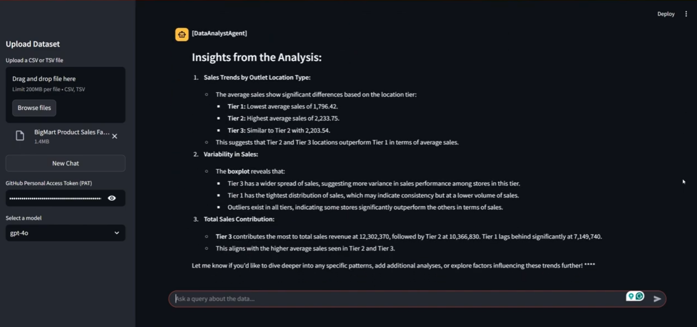
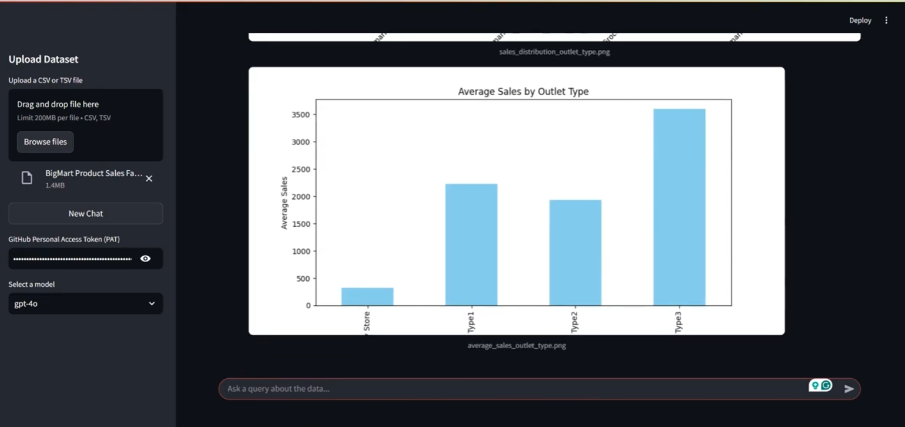

# Data Analyst Agent 📊

A powerful multi-agent system built with AutoGen 0.4 that provides automated data analysis, visualization, and insights generation through an interactive chat interface.

[**📈 Try It Out!**]([https://data-analyst-agent.streamlit.app/](https://data-analyst-agent-hzdlcenc3nmcku72vyw3jn.streamlit.app/)


Check out the demos 👇🏼

[](https://youtu.be/Gml54d2FBm0)

[](https://youtu.be/aVxbSUrsEq4)

## Features

- **Multi-Agent Architecture**
  - **Data Analyst Agent:** Plans and generates analysis code, creates visualizations, extracts insights
  - **Code Executor Agent:** Executes code, provides debugging feedback, ensures successful execution
  - Agents collaborate through a `RoundRobinGroupChat` system for iterative improvements

- **Interactive Analysis**
  - Upload CSV/TSV datasets through a Streamlit interface
  - Ask questions about your data in natural language
  - Receive detailed analysis plans, visualizations, and insights
  - Real-time code execution and feedback loop

- **Advanced Capabilities**
  - Automated Python code generation for data analysis
  - Dynamic visualization creation using popular libraries
  - Intelligent error handling and debugging
  - Persistence of chat history and analysis results
  - Support for large datasets

## Technology Stack

- **Framework**: AutoGen + Streamlit
- **Code Execution**: Local command-line Python executor
- **File Formats**: CSV, TSV support

## Setup

### Prerequisites
- Python 3.10 or higher
- `uv` package installer, recommended for Python project management ([Reference](https://docs.astral.sh/uv/#installation))
- Retrieve Your GitHub Personal Access Token (PAT)
    <details>
    <summary>How to generate a GitHub PAT?</summary>

    We'll use **Github Models Marketplace** to get free access to Large Language Models (LLMs) that will be used to create AI Agents.

    To access this service, you will need to create a **GitHub Personal Access Token (PAT)**.

    This can be done by going to your [Personal Access Tokens settings](https://github.com/settings/personal-access-tokens) in your GitHub Account.

    Select the `Fine-grained tokens` option on the left side of your screen.

    Then select `Generate new token`.

    Add a **Token Name** & within **Permissions**, select `Read-only` access for **Models**. Then click `Generate token`.
    </details>

### Installation
1. Clone the repository & get into the project directory
    ```sh
    git clone https://github.com/tezansahu/ai-garage.git
    cd ai-garage/data-analyst-agent-autogen
    ```

2. Create and activate a virtual environment using `uv`:
    ```sh
    uv venv
    # On Windows
    .\.venv\Scripts\activate
    # On macOS/Linux
    source .venv/bin/activate
    ```
3. Install all dependencies
    ```sh
    uv sync
    ```
4. Run the Streamlit app:
    ```sh
    streamlit run app.py
    ```

## Usage

1. Launch the application
2. Upload your dataset (CSV/TSV) using the sidebar
3. Add your GitHub PAT & select the LLM you wish to use
3. Ask questions about your data in natural language
4. View generated visualizations and insights
5. Use "New Chat" to start fresh analysis


Get me insights related to distribution of sales w.r.t outlet type
